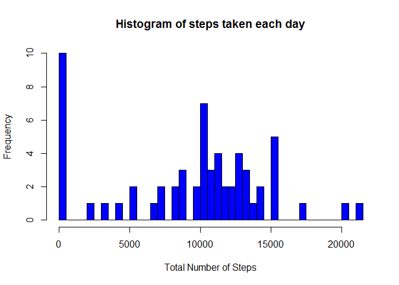
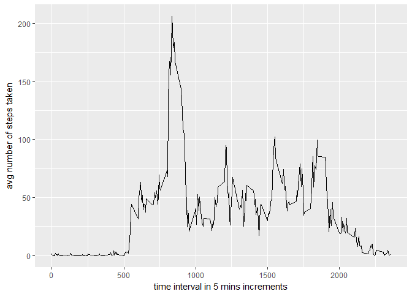
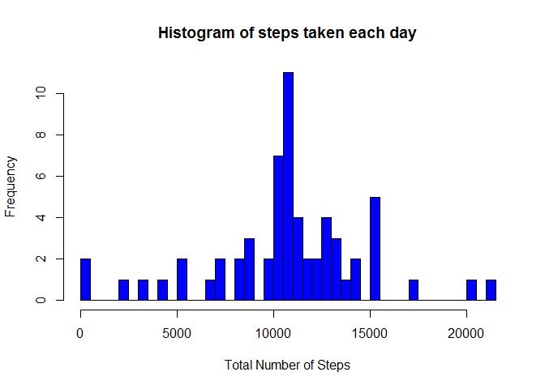
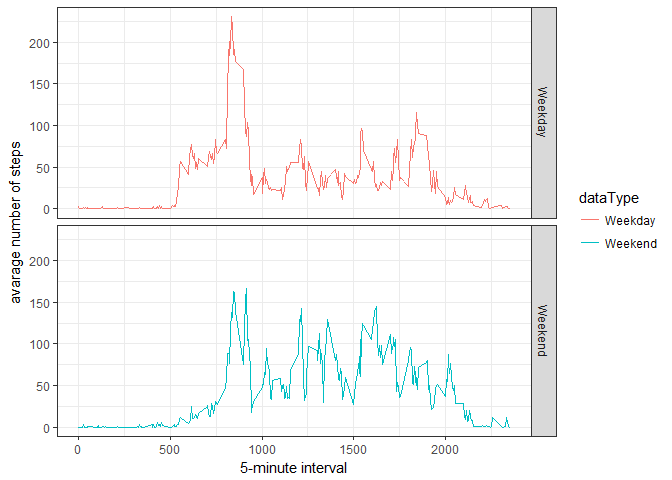

# Reproducible Research: Peer Assessment 1

## Load required libraries


```r
library(ggplot2)
```

## Loading and preprocessing of the data
##### 1. Load the data (i.e. read.csv())


```r
if(!file.exists("activity.csv"))
  unzip("repdata_data_activity.zip")

activity<-read.csv("activity.csv")
```
##### 2. Process/transform the data (if necessary) into a format suitable for your analysis


```r
activity$date<-as.Date(activity$date)
```

## What is mean total number of steps taken per day?


```r
totalsteps<-tapply(activity$steps,activity$date,sum,na.rm=TRUE)
```

##### 1. Make a histogram of the total number of steps taken each day

```r
hist(totalsteps, 
     breaks = 50,
     main = "Histogram of steps taken each day",
     xlab = 'Total Number of Steps',
     col = 'blue')
```

<!-- -->

##### 2. Calculate and report the mean and median total number of steps taken per day

```r
meansteps<-mean(totalsteps,na.rm=TRUE)
mediansteps<-median(totalsteps,na.rm=TRUE)
```

* Mean steps taken per day 9354.2295082
* Median steps taken per day 10395

## What is the average daily activity pattern?

```r
avgsteps<-aggregate(x= list(meansteps = activity$steps), by=list(interval = activity$interval),FUN=mean,na.rm=TRUE)
```
##### 1. Make a time series plot

```r
ggplot(avgsteps,aes(interval,meansteps))+geom_line()+xlab("time interval in 5 mins increments")+ylab("avg number of steps taken")
```

<!-- -->

##### 2. Which 5-minute interval, on average across all the days in the dataset, contains the maximum number of steps?


```r
maxstepsint<-avgsteps[which.max(avgsteps$meansteps),"interval"]
```
* Max steps related interval 835

## Imputing missing values
##### 1. Calculate and report the total number of missing values in the dataset 

```r
missingvalues<-sum(is.na(activity))
```
* Total Number of Missing Values 2304

##### 2. Create a new dataset that is equal to the original dataset but with the missing data filled in.


```r
activityDataImputed<-activity
```
##### 3. Devise a strategy for filling in all of the missing values in the dataset.

```r
activityDataImputed$steps[which(is.na(activityDataImputed$steps))]<-tapply(activityDataImputed$steps,activityDataImputed$interval,mean,na.rm=TRUE,simplify = FALSE)
activityDataImputed$steps <- as.vector(activityDataImputed$steps, mode="numeric")
```
##### 4. Make a histogram of the total number of steps taken each day 

```r
totalstepsImputed<-tapply(activityDataImputed$steps,activityDataImputed$date,sum,na.rm=TRUE)
hist(totalstepsImputed, 
     breaks = 50,
     main = "Histogram of steps taken each day",
     xlab = 'Total Number of Steps',
     col = 'blue')
```

<!-- -->

## Are there differences in activity patterns between weekdays and weekends?
##### . Identify the weekday and weekend data

```r
activityDataImputed$dataType<-ifelse(as.POSIXlt(activityDataImputed$date)$wday %in% c(0,6),'Weekend','Weekday')
avgActivityDataImputed<-aggregate(activityDataImputed$steps, by=list(activityDataImputed$interval,activityDataImputed$dataType),mean)
names(avgActivityDataImputed)<-c("interval","dataType","steps")
```
##### . Plot the data


```r
ggplot(avgActivityDataImputed, aes(interval, steps,color=dataType) ) + 
  geom_line() + theme_bw()+
    xlab("5-minute interval") + 
  ylab("avarage number of steps")+
    facet_grid(dataType ~ .) 
```

<!-- -->
